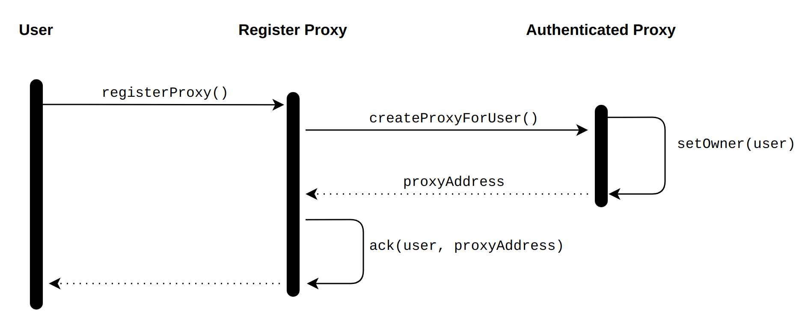
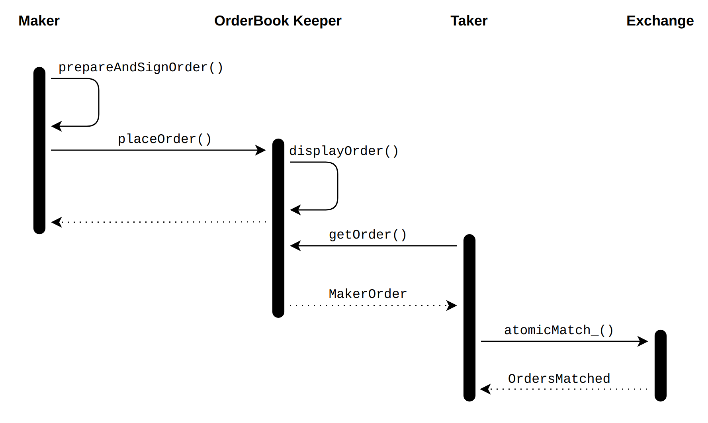
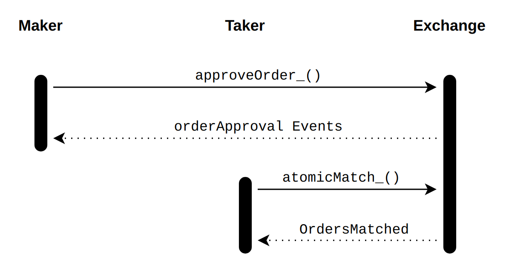

# Contracts
```json
"testnet": {
    "Migrations": "0xeC825FF6EA348a1CE58CC02Da29C196584A39258",
    "TaureumProxyRegistry": "0xAaF7595B77c0de6511fd3EAD537E9034830ea4Cf",
    "TaureumTokenTransferProxy": "0xaa5C6B9ddF867f4e5e4bf4402a4369f94f071805",
    "TaureumExchange": "0xF4Cad33054f83D6f05FF1aDbA789864dF8b3FEc2"
}
```

## TaureumRegistry
This contract keeps a mapping of `AuthenticatedProxy` contracts and mapping of contracts authorized to access them. This contract is abstracted away from the `Exchange` (a) to reduce `Exchange` attack surface and (b) so that the `Exchange` contract can be upgraded without users needing to transfer assets to new proxies. Also, a `Proxy` is used to make trades on behalf of the order's maker so that trades can happen when the maker isn't online.

On the first time interacting with the `Exchange` contract (explained below), a user must register an `AuthenticatedProxy` contract. This contract will act on-behalf of the user to transfer assets in a trade. To do this, the user only needs to call the `registerProxy` function to the `ProxyRegister` contract. Here is the flow of this operation.



### Example
[1-proxy-register.js](examples/1-proxy-register.js)

## Orders
An `Order` on the `TaureumExchange` consists of the following fields.
```solidity
/* An order on the exchange. */
struct Order {
    /* Exchange address, intended as a versioning mechanism. */
    address exchange;
    /* Order maker address. */
    address maker;
    /* Order taker address, if specified. */
    address taker;
    /* Maker relayer fee of the order, unused for taker order. */
    uint makerRelayerFee;
    /* Taker relayer fee of the order, or maximum taker fee for a taker order. */
    uint takerRelayerFee;
    /* Maker protocol fee of the order, unused for taker order. */
    uint makerProtocolFee;
    /* Taker protocol fee of the order, or maximum taker fee for a taker order. */
    uint takerProtocolFee;
    /* Order fee recipient or zero address for taker order. */
    address feeRecipient;
    /* Fee method (protocol token or split fee). */
    FeeMethod feeMethod;
    /* Side (buy/sell). */
    SaleKindInterface.Side side;
    /* Kind of sale. */
    SaleKindInterface.SaleKind saleKind;
    /* Target. */
    address target;
    /* HowToCall. */
    AuthenticatedProxy.HowToCall howToCall;
    /* Calldata. */
    bytes callData;
    /* Calldata replacement pattern, or an empty byte array for no replacement. */
    bytes rplmPattern;
    /* Static call target, zero-address for no static call. */
    address staticTarget;
    /* Static call extra data. */
    bytes staticExtradata;
    /* Token used to pay for the order, or the zero-address as a sentinel value for Ether. */
    address paymentToken;
    /* Base price of the order (in paymentTokens). */
    uint basePrice;
    /* Auction extra parameter - minimum bid increment for English auctions, starting/ending price difference. */
    uint extra;
    /* Listing timestamp. */
    uint listingTime;
    /* Expiration timestamp - 0 for no expiry. */
    uint expirationTime;
    /* Order salt, used to prevent duplicate hashes. */
    uint salt;
}
```
**Name** | **Type** | **Description**
---|---|---
exchange | address | The exchange address (must match the address of this contract).
maker | address | The address of the order maker.
taker | address | The address of the order taker.
makerRelayerFee | uint256 | The maker-relayer fee of the order (unused for the taker).
takerReleyerFee | uint256 | The taker-relayer fee of the order (unused for the maker).
makerProtocolFee | uint256 | The fee for the protocol, paid by the maker (right now, it should be set to 0).
takerProtocolFee | uint256 | The fee for the protocol, paid by the taker (right now, it should be set to 0).
feeRecipient | address | The address of the fee-receiver of this order.
feeMethod | uint8 | The method for paying the order fee (0 - ProtocolFee, 1 - SplitFee).
orderSide | uint8 | The side of this order (0 - buy, 1 - sell).
saleKind | uint8 | The type of action for this order (0 - fixed-price, 1 - Dutch auction).
assetTarget | address | The address of the asset being traded (including but not limited to NFTs).
howToCall | uint8 | The way to call the assetTarget (0 - Call, 1 - DelegateCall).
callData | bytes | The data for the call.
rplmPattern | bytes | The replacement pattern for the callData (must have the same size of the callData or an empty for no replacement).
staticTarget | address | The target address for the predicate function for state checking.
staticExtraData | bytes | The extra data for the predicate function.
paymentToken | address | The token address for the order (zero-address for BNB).
basePrice | uint256 | The base price of the order calculated in paymentToken.
extra | uint256 | An auction extra parameter (used in Dutch auction to calculate the price difference over time).
listingTime | uint256 | The order listing time, before which the order cannot be matched (in seconds).
expirationTime | uint256 | The order expiration time, after which the order cannot be matched (in seconds).
salt | uint256 | Order salt for hash deduplication.

### Constructing an order
* Prepare necessary information: exchange, fee, listing time, expired time, salt, etc. 
* Prepare the callData: at this step, we prepare the callData for the proxy call. The callData should follow the layout defined in this [post](https://docs.soliditylang.org/en/v0.6.7/internals/layout_in_calldata.html).
* Create the replacement pattern for the callData. Since an order might be signed off-chain with some default values set (because at the time of signing the order, these values have not been determined, e.g, taker). We need a method to replace the default value with meaningful values (e.g, the real taker address).  This is where the rplmPattern comes as a rescue. The rplmPattern allows us to replace some values of the callData with another data at the location specified by the rplmPattern. If the byte value at position i of rplmPattern is non-zero, the value at position of the callData should be replaced. Otherwise, it should not be replaced. In case no value of the callData is allowed to replace, rplmPattern should be left empty.

### Example

## TaureumExchange
This is the main contract consisting of the whole logic of a decentralized exchange. The main flow of trading assets is depicted in the following figure. Here, we assume the existence of an `OrderBookKeeper`.

Next, we explain some methods provided by the `Exchange` contract.

### `approveOrder_()`
This function is called by the maker to authorize his order.
```solidity
function approveOrder_ (
        address[7] memory addrs,
        uint[9] memory uints,
        FeeMethod feeMethod,
        SaleKindInterface.Side side,
        SaleKindInterface.SaleKind saleKind,
        AuthenticatedProxy.HowToCall howToCall,
        bytes memory callData,
        bytes memory replacementPattern,
        bytes memory staticExtradata,
        bool orderbookInclusionDesired)
```
Apart from self-explained parameters, we describe grouped parameters as follows.
* `addrs`
```solidity
{exchange, maker, taker, feeRecipient, target, staticTarget, paymentToken}
```
What this means is that `addrs[0] = exchange, addrs[1] = maker`, and so on.

* `uints`
```solidity
{makerRelayerFee, takerRelayerFee, makerProtocolFee, takerProtocolFee, basePrice, extra, listingTime, expirationTime, salt}
```
This function emits 2 approval events (instead of 1 due to the stack-size limitation).
```solidity
event OrderApprovedPartOne    (bytes32 indexed hash, address exchange, address indexed maker, address taker, uint makerRelayerFee, uint takerRelayerFee, uint makerProtocolFee, uint takerProtocolFee, address indexed feeRecipient, FeeMethod feeMethod, SaleKindInterface.Side side, SaleKindInterface.SaleKind saleKind, address target);
event OrderApprovedPartTwo    (bytes32 indexed hash, AuthenticatedProxy.HowToCall howToCall, bytes callData, bytes replacementPattern, address staticTarget, bytes staticExtradata, address paymentToken, uint basePrice, uint extra, uint listingTime, uint expirationTime, uint salt, bool orderbookInclusionDesired);
```

#### Example
[3-approve-order.js](examples/3-approve-order.js)

### `cancelOrder_()`
This function is used to cancel an order so that the exchange will not match it in the future. The parameters are the same as the above `approveOrder_()` function together with three more parameters (v, r, s) for the ECDSA signature.
```solidity
function cancelOrder_(
            address[7] memory addrs,
            uint[9] memory uints,
            FeeMethod feeMethod,
            SaleKindInterface.Side side,
            SaleKindInterface.SaleKind saleKind,
            AuthenticatedProxy.HowToCall howToCall,
            bytes memory callData,
            bytes memory replacementPattern,
            bytes memory staticExtradata,
            uint8 v,
            bytes32 r,
            bytes32 s)
        public
```
This function emits an `OrderCancelled` event.
```solidity
event OrderCancelled          (bytes32 indexed hash);
```

#### Example
[4-cancel-order.js](examples/4-cancel-order.js)

### `atomicMatch_()`
This function is called to match two orders. It is called when both the `MakerOrder` and `TakerOrder` are ready. Here, **B** denotes the `BuyOrder` while **S** denotes the `SellOrder`.

Here is the explanation of each grouped parameter, other parameters are self-explained from their name.
* `addrs`
```solidity
{B.exchange, B.maker, B.taker, B.feeRecipient, B.target, B.staticTarget, B.paymentToken, S.exchange, S.maker, S.taker, S.feeRecipient, S.target, S.staticTarget, S.paymentToken}
```

* `uints`
```solidity
{B.makerRelayerFee, B.takerRelayerFee, B.makerProtocolFee, B.takerProtocolFee, B.basePrice, B.extra, B.listingTime, B.expirationTime, B.salt, S.makerRelayerFee, S.takerRelayerFee, S.makerProtocolFee, S.takerProtocolFee, S.basePrice, S.extra, S.listingTime, S.expirationTime, S.salt}
```

* `feeMethodsSidesKindsHowToCalls`
```solidity
{B.feeMethod, B.side, B.saleKind, B.howToCall, S.feeMethod, S.side, S.saleKind, S.howToCall}
```

* `vs`
```solidity
{B.sig.v, S.sig.v}
```

* `rssMetadata`
```solidity
{B.sig.r, B.sig.s, S.sig.r, S.sig.s, Metadata}
```
Here, `metadata` is the information that will be emitted in the `OrdersMatch` event.

This function emits an `OrdersMatch` event of the following form.
```solidity
event OrdersMatched           (bytes32 buyHash, bytes32 sellHash, address indexed maker, address indexed taker, uint price, bytes32 indexed metadata);
```

#### Example
[5-atomic-match.js](examples/5-atomic-match.js)

### Matching orders
Two orders can match if they satisfy the conditions defined in the function `ordersCanMatch`.
```solidity
function ordersCanMatch(Order memory buy, Order memory sell)
        internal
        view
        returns (bool)
{
    return (
        /* Must be opposite-side. */
        (buy.side == SaleKindInterface.Side.Buy && sell.side == SaleKindInterface.Side.Sell) &&     
        /* Must use same fee method. */
        (buy.feeMethod == sell.feeMethod) &&
        /* Must use same payment token. */
        (buy.paymentToken == sell.paymentToken) &&
        /* Must match maker/taker addresses. */
        (sell.taker == address(0) || sell.taker == buy.maker) &&
        (buy.taker == address(0) || buy.taker == sell.maker) &&
        /* One must be maker and the other must be taker (no bool XOR in Solidity). */
        ((sell.feeRecipient == address(0) && buy.feeRecipient != address(0)) || (sell.feeRecipient != address(0) && buy.feeRecipient == address(0))) &&
        /* Must match target. */
        (buy.target == sell.target) &&
        /* Must match howToCall. */
        (buy.howToCall == sell.howToCall) &&
        /* Buy-side order must be settleable. */
        SaleKindInterface.canSettleOrder(buy.listingTime, buy.expirationTime) &&
        /* Sell-side order must be settleable. */
        SaleKindInterface.canSettleOrder(sell.listingTime, sell.expirationTime)
    );
}
```
* They are on different sides (one Buy, one Sell).
* They use the same `feeMethod`.
* They use the same `paymentToken`.
* One must be the `Maker`, the other must be the `Taker`.
* They use the same `target`.
* They use the same `howToCall`.
* They are both not expired.

Orders can be matched in two different ways.
#### Pre-signed order 
In this method, the `Maker` creates his order, signs and sends this order to an `OrderBookKeeper` (or `Keeper` for short) off-chain. This method is completely free. The steps are as follows.
* The `Maker` creates and signs his order (i.e, `MakerOrder`) off-chain.
* The `Maker` sends the order to the `Keeper`.
* The `Taker` gets the `MakerOrder` detail from the `Keeper` and creates the counter-order (i.e, `TakerOrder`).
* The `Taker` calls the function `atomicMatch_` from the `Exchange` contract to execute the trade.



#### Pre-approved order
This method may be especially useful for orders created by smart contracts, which cannot sign messages off-chain. On-chain authorization generates an event that order-book services can easily index if they want to include the order in their database. Furthermore, it does not require any centralized `Keeper`.
* The `Maker` creates and signs the `MakerOrder` off-chain.
* The `Maker` approves the order by calling the function `approveOrder_` from the `Exchange`.
* The `Taker` creates the counter-order (i.e, `TakerOrder`), and calls the function `atomicMatch_` to execute the trade.


